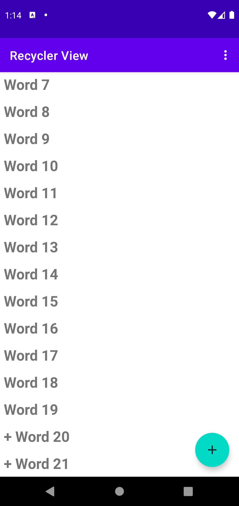
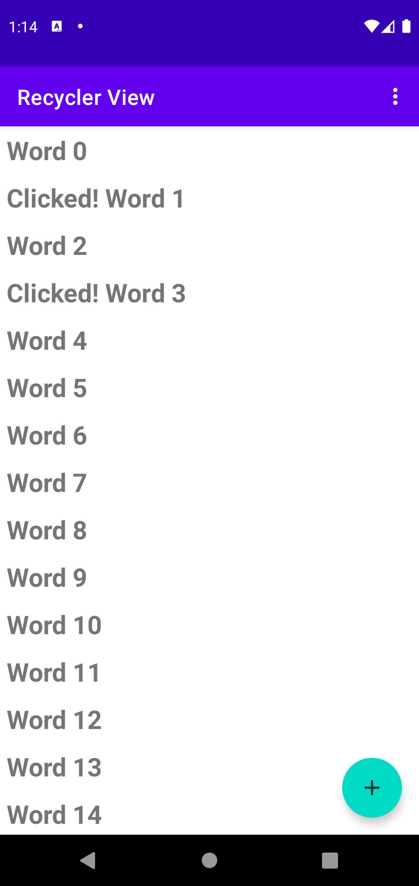
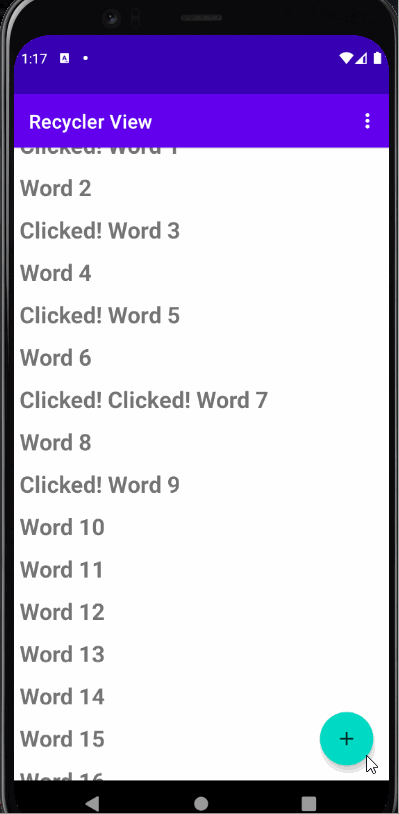
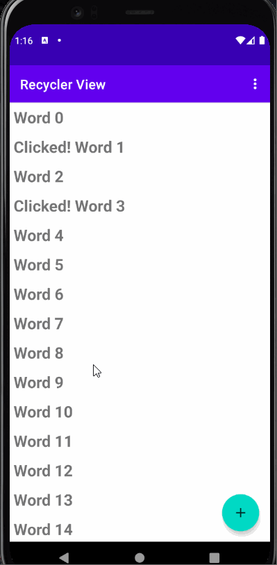
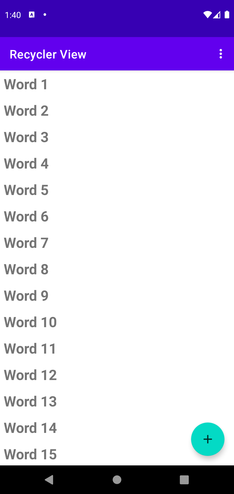
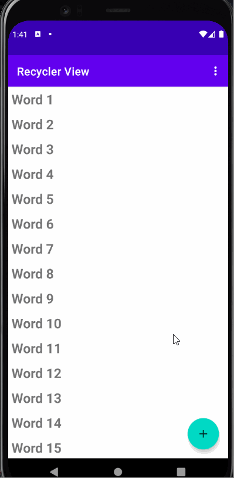
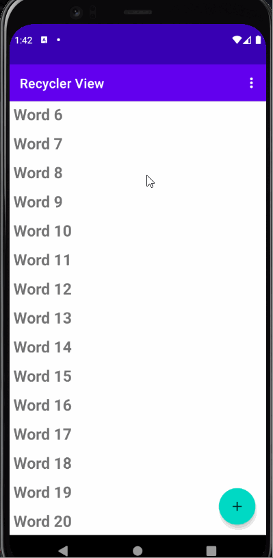
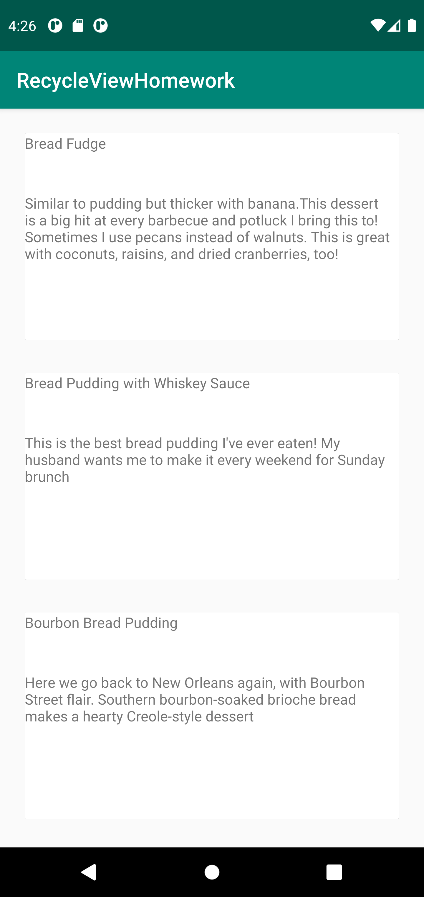
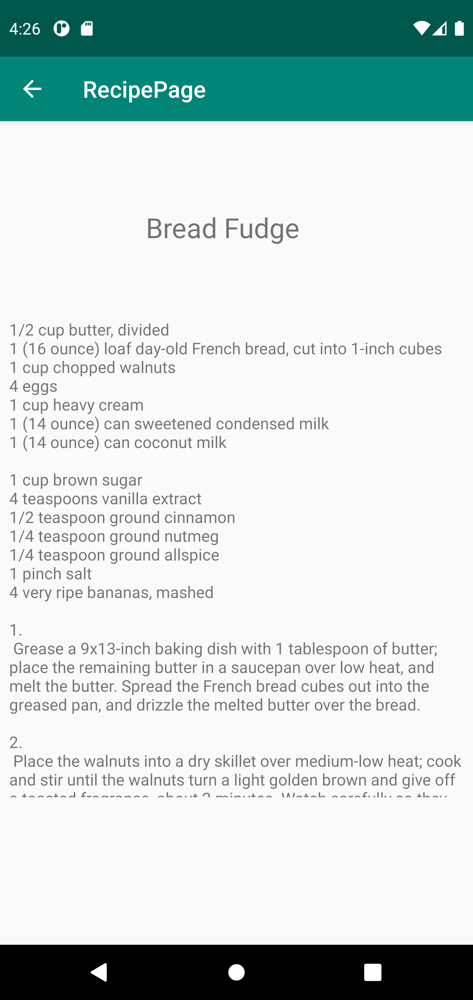
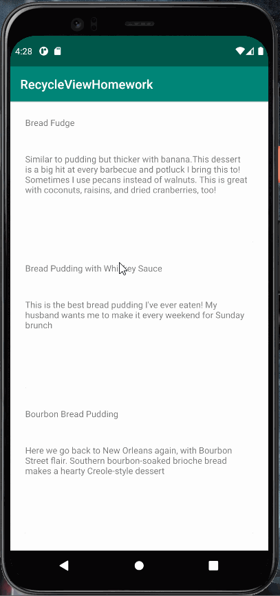

# Lab-6-RecycleView

### RecycleView Application Overview

- Application Index

- When Add Icon is Clicked

- When Items are Clicked

### RecycleView Application Workings

  - Add Button

  - Clicked Items

# Recycle View Challenge

### Recycle View Challenge Overview

- Application Index

### Recycle View Challenge Application Workings

- Reset Button

# RecycleViewHomework

### RecycleViewHomework Application Overview

- Application List Index

- Application Detail-Ingrediants Index

### RecycleViewHomework Application Workings

  - Item Clicked will redirect to Detail-Ingredients Page

  
